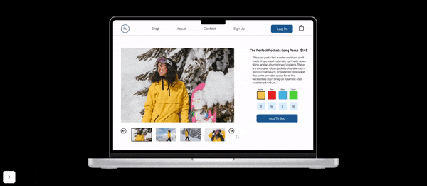

 
 

<h1>
  
  Winter Store Template
</h1>

This website template is a winter clothing store, created in Figma.

 

<h2>

Usage
</h2>

To use and explore the website template, you can access the website by clicking <a href="https://www.figma.com/proto/Ni2RinJFBG8ZkWL4uiAREp/%5BTemplate%5D-Ridgeline-Prototype-(Copy)?type=design&node-id=1603-262&scaling=scale-down&page-id=0%3A1&starting-point-node-id=1603%3A262">here</a>.

 

<h2>

Video Demo
</h2>

If you want to see a video of this website, please click <a href="https://vimeo.com/827087785">here</a> to watch the demo. Keep in mind that this video might be slightly different from the current code in this repository since it is being regularly updated.

 

<h2>

Technologies Used</h2>
  
Figma

 

<h2>

License
</h2>

All rights reserved.

